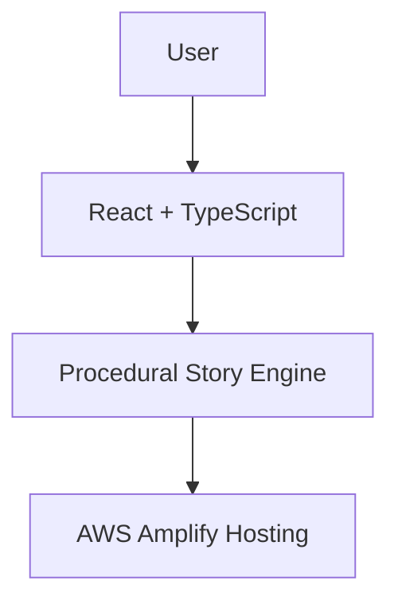

# PlotTwist

**Every Choice Creates a Different Story**

PlotTwist is an interactive branching storytelling application where every decision changes what happens next. Built with React, TypeScript, Vite, and a custom procedural story engine with browser storage persistence, deployed on AWS Amplify Hosting.

---

## Features

- **Interactive Branching Storytelling**: Generates rich, dynamic story chapters locally using a deterministic procedural story engine.
- **6 Creative Story Genres**: Fantasy, Science Fiction, Mystery, Adventure, Horror, and Comedy.
- **Custom Character Creation**: Craft your hero's name and background or let the story engine generate one.
- **Atmospheric Settings**: Select from curated settings or enter custom realms.
- **Deterministic Seeded Randomization**: Every story receives a unique seed, ensuring identical replayability when refreshing or re-entering the seed.
- **Flag-Based Choice System**: User decisions update narrative flags (`controlRoomVisited`, `trustedStranger`, `foundKey`, etc.) that shape future events and endings.
- **Exactly 3 Choices Per Non-Final Chapter**: Branching decisions (A, B, C) guide plot direction.
- **Dynamic Endings**: Resolves central narrative arcs tailored to accumulated story flags.
- **Story Length Options**: Quick Adventure (3 Chapters) or Standard Adventure (5 Chapters).
- **Digital Storybook UX**: Modern dark-mode interface with smooth page transitions and mobile responsiveness.
- **Story Export & Sharing**: Copy full story text or share via the Web Share API.
- **Browser Persistence**: Saves active story state, seed, flags, and completed chapters in local storage.

---

## Architecture



```
User
  ↓
React + TypeScript
  ↓
Procedural Story Engine
  ↓
AWS Amplify Hosting
```

---

## Technical Stack

- **Frontend Framework**: React 18, TypeScript, Vite.
- **Story Engine**: Deterministic Seeded PRNG (Mulberry32), Flag-Based Branching Logic, Modular Content Generators (`frontend/src/storyEngine/`).
- **Styling**: Tailwind CSS, Lucide React icons.
- **Testing**: Vitest, React Testing Library.
- **Deployment**: AWS Amplify Hosting.

---

## Project Structure

```
plottwist-ai/
├── frontend/
│   ├── src/
│   │   ├── storyEngine/
│   │   │   ├── types.ts       # Story engine interface definitions
│   │   │   ├── random.ts      # Seeded PRNG (Mulberry32)
│   │   │   ├── generator.ts   # Core chapter generator orchestration
│   │   │   ├── genres.ts      # 6 Genre configurations & settings
│   │   │   ├── openings.ts    # Chapter 1 opening templates
│   │   │   ├── events.ts      # Mid-chapter event templates
│   │   │   ├── twists.ts      # Plot twist intensity templates
│   │   │   ├── endings.ts     # Flag-dependent ending templates
│   │   │   └── branches.ts    # Branching & choice flag helper functions
│   │   ├── components/        # React UI components
│   │   ├── hooks/             # Custom React hooks (useStory)
│   │   ├── services/          # Story engine API abstraction
│   │   ├── types/             # Frontend data structures
│   │   └── __tests__/         # Vitest unit & integration test suites
├── experimental/
│   └── bedrock-backend/       # Archived Bedrock/Lambda/SAM backend (experimental)
└── README.md
```

---

## Local Development Setup

### Prerequisites

- Node.js v20+ and npm v10+

### 1. Install Dependencies

```bash
cd frontend
npm install
```

### 2. Run Local Development Server

```bash
npm run dev
```

Open `http://localhost:5173` in your browser.

### 3. Run Test Suites

```bash
npm test
```

### 4. Build Production Bundle

```bash
npm run build
```

---

## Automated Test Coverage

The Vitest test suite (`frontend/src/__tests__/storyEngine.test.ts` & `useStory.test.ts`) verifies:
1. **Seeded Randomness**: Same seed generates identical story content across runs.
2. **Seed Variation**: Different seeds generate noticeably different stories.
3. **Choice Consequences**: Decisions mutate flags and influence subsequent chapters and endings.
4. **Exactly 3 Choices**: Non-final chapters always provide 3 choices.
5. **Chapter Progression**: Supports 3-chapter Quick and 5-chapter Standard adventures.
6. **Final Endings**: Endings reflect accumulated flags and complete without choice cards.
7. **Persistence**: Saves and restores state, seed, and flags cleanly in browser storage.

---

## AWS Amplify Hosting Deployment Steps

1. Push your repository to **GitHub**:
   ```bash
   git add .
   git commit -m "Deploy PlotTwist procedural story engine"
   git push origin main
   ```
2. Open the **AWS Management Console** and navigate to **AWS Amplify**.
3. Click **Host web app** and connect your GitHub repository (`plottwist-ai`).
4. Select the `main` branch.
5. Configure build settings:
   - **App root**: `frontend`
   - **Build command**: `npm run build`
   - **Output directory**: `dist`
6. Click **Save and Deploy**.
7. AWS Amplify will automatically build and deploy your application to a global CDN endpoint with HTTPS enabled.

---

## Footer

"Built with React and deployed on AWS Amplify."

---

## Author

**Pamuda U. de A. Goonatilake**
