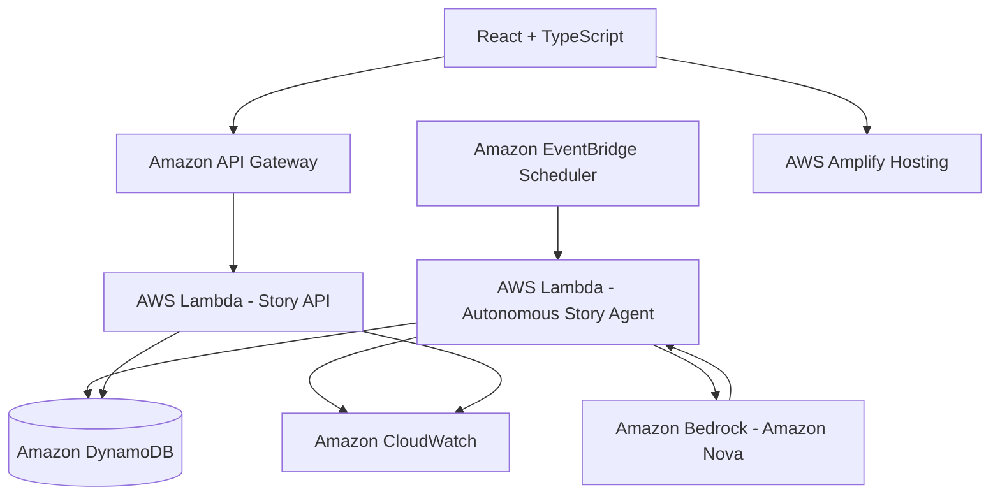

# PlotTwist Autopilot

**PlotTwist Autopilot** is an autonomous creative storytelling agent built for the **AWS Weekend Creative Agent Challenge: Set Your Creative App Free**.

The original PlotTwist lets users shape interactive branching stories. PlotTwist Autopilot goes one step further: **it keeps writing even when nobody is using it.**

---

## Overview

PlotTwist Autopilot turns the interactive storytelling application into an always-on autonomous narrative creator. An EventBridge Scheduler wakes up an AWS Lambda function on a configurable schedule, which uses Amazon Bedrock (Amazon Nova) to write a brand new, time-period-sensitive story and save it directly to Amazon DynamoDB. When a user opens the application later, the site displays a notification summarizing what was written "While You Were Away".

---

## What Changed: Interactive vs Autopilot

- **The Original PlotTwist**: Wait for a user to configure settings, make decisions, and advance the story manually chapter-by-chapter.
- **PlotTwist Autopilot**: Automatically writes complete standalone stories (approximately 500–800 words) using Bedrock 24/7 without any user interaction or browser session active.

---

## Architecture



---

## Repository Structure

```
plottwist-ai/
│
├── frontend/                     # Deployed React + TS Frontend
│   ├── src/
│   │   ├── components/autopilot/ # Autopilot dashboard elements
│   │   ├── pages/                # Autopilot overview & details pages
│   │   ├── services/             # autopilotApi service
│   │   ├── utils/                # lastVisit logic helper
│   │   └── ...
│
├── agent/                        # TypeScript Lambda backend
│   ├── src/
│   │   ├── handlers/             # Scheduler & API Gateway Lambda entrypoints
│   │   ├── services/             # Bedrock and DynamoDB interfaces
│   │   └── utils/                # Timeperiod, parser, and briefs
│   └── tests/                    # Vitest backend tests
│
├── infrastructure/               # AWS SAM Infrastructure
│   ├── template.yaml             # SAM/CloudFormation templates
│   └── samconfig.example.toml    # Deployment parameters template
│
└── docs/                         # Guides and architectural blueprints
```

---

## Local Development & Testing

### 1. Backend Agent

```bash
cd agent
npm install
npm run test
npm run build
```

### 2. Frontend Integration

```bash
cd frontend
npm install
npm run test
npm run build
```

---

## Deployment

Refer to the complete deployment instructions in [`docs/deployment.md`](file:///c:/Users/Nanotek/Desktop/GitHub/plottwist-ai/docs/deployment.md).

---

## Challenge Evidence

Refer to the checklist in [`docs/challenge-evidence.md`](file:///c:/Users/Nanotek/Desktop/GitHub/plottwist-ai/docs/challenge-evidence.md) to capture logs and screenshot proof of autonomous generation on AWS.
