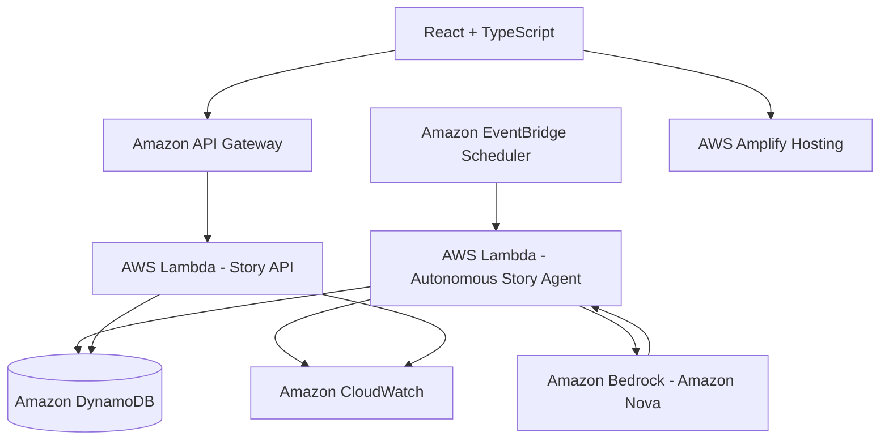

# PlotTwist Autopilot Architecture

This document maps out the system architecture of **PlotTwist Autopilot** built for the AWS Weekend Creative Agent Challenge.

## Overview

Unlike the interactive story generation engine, PlotTwist Autopilot operates autonomously. An EventBridge Scheduler wakes up the backend Lambda function on a configurable cadence to call Bedrock (using Amazon Nova) and generate complete standalone story artifacts stored in DynamoDB, which are then consumed by the React/TS UI through API Gateway.

## Architecture Diagram

## Component Breakdown

1. **Amazon EventBridge Scheduler**: Schedules target invocation using Scheduler V2 (`AWS::Scheduler::Schedule`). Periodically fires and invokes the Generator Lambda directly.
2. **Autonomous Generator Lambda (`plottwist-autopilot-generator`)**: Decodes time execution metadata, constructs a randomized, time-aware Creative Brief, invokes Bedrock, parses/validates output, and performs conditional DynamoDB insertion.
3. **Amazon Bedrock (Amazon Nova)**: Executes high-quality standalone story rendering utilizing system and user prompt structures.
4. **Amazon DynamoDB (`plottwist-autopilot-stories-[Environment]`)**: Stores completed stories. Uses on-demand billing, SSE encryption, and a GSI (`GSI1`) mapping `generationType` to `generatedAt` to list stories chronologically.
5. **Amazon API Gateway HTTP API**: Exposed read-only routes serving as request router proxying API Lambda.
6. **API Lambda (`plottwist-autopilot-api`)**: Fetches items from DynamoDB and services `/health`, `/stories`, `/stories/latest`, `/stories/{id}`, and `/agent/status` routes.
7. **React/TypeScript Frontend**: Embedded Autopilot page, navigation tabs, While You Were Away notification, and story pages.
8. **Amazon CloudWatch**: Log output target storing system metrics and custom transaction states (`AUTONOMOUS_GENERATION_STARTED`, etc.).
